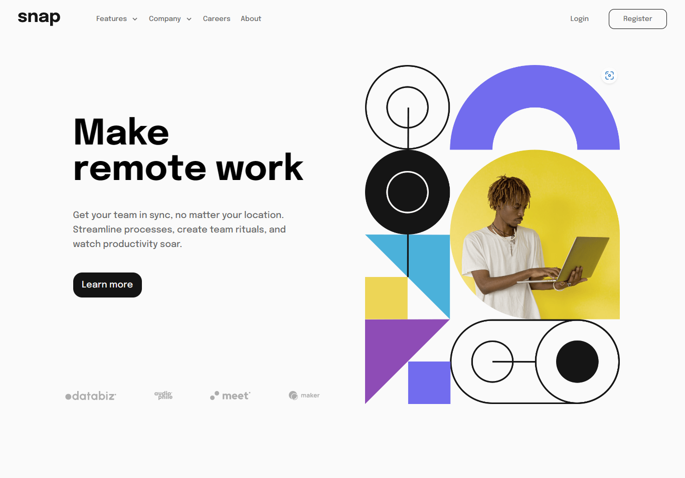

# Frontend Mentor - Intro section with dropdown navigation solution

This is a solution to the [Intro section with dropdown navigation challenge on Frontend Mentor](https://www.frontendmentor.io/challenges/intro-section-with-dropdown-navigation-ryaPetHE5). Frontend Mentor challenges help you improve your coding skills by building realistic projects.

## Table of contents

-   [Overview](#overview)
    -   [The challenge](#the-challenge)
    -   [Screenshot](#screenshot)
    -   [Links](#links)
-   [My process](#my-process)
    -   [Built with](#built-with)
    -   [What I learned](#what-i-learned)
-   [Author](#author)

## Overview

### The challenge

Users should be able to:

-   View the relevant dropdown menus on desktop and mobile when interacting with the navigation links
-   View the optimal layout for the content depending on their device's screen size
-   See hover states for all interactive elements on the page

### Screenshot



### Links

-   Solution URL: [Add solution URL here](https://your-solution-url.com)
-   Live Site URL: [Add live site URL here](https://your-live-site-url.com)

## My process

### Built with

-   Semantic HTML5 markup
-   CSS custom properties
-   Flexbox
-   CSS Grid
-   Mobile-first workflow

### What I learned

```css
.menu-items > :is(div .flex) {
	width: 232px;
	font-size: 0.85em;
}
```

```js
function drop() {
	let arrow = document.getElementById("features-link").children[1];
	let sub_menu = document.getElementById("features");

	arrow.classList.toggle("icon-arrow-up");
	sub_menu.classList.toggle("sub-list-show");
}
```

## Author

-   Twitter - [@mkmilly02](https://www.twitter.com/mkmilly02)
